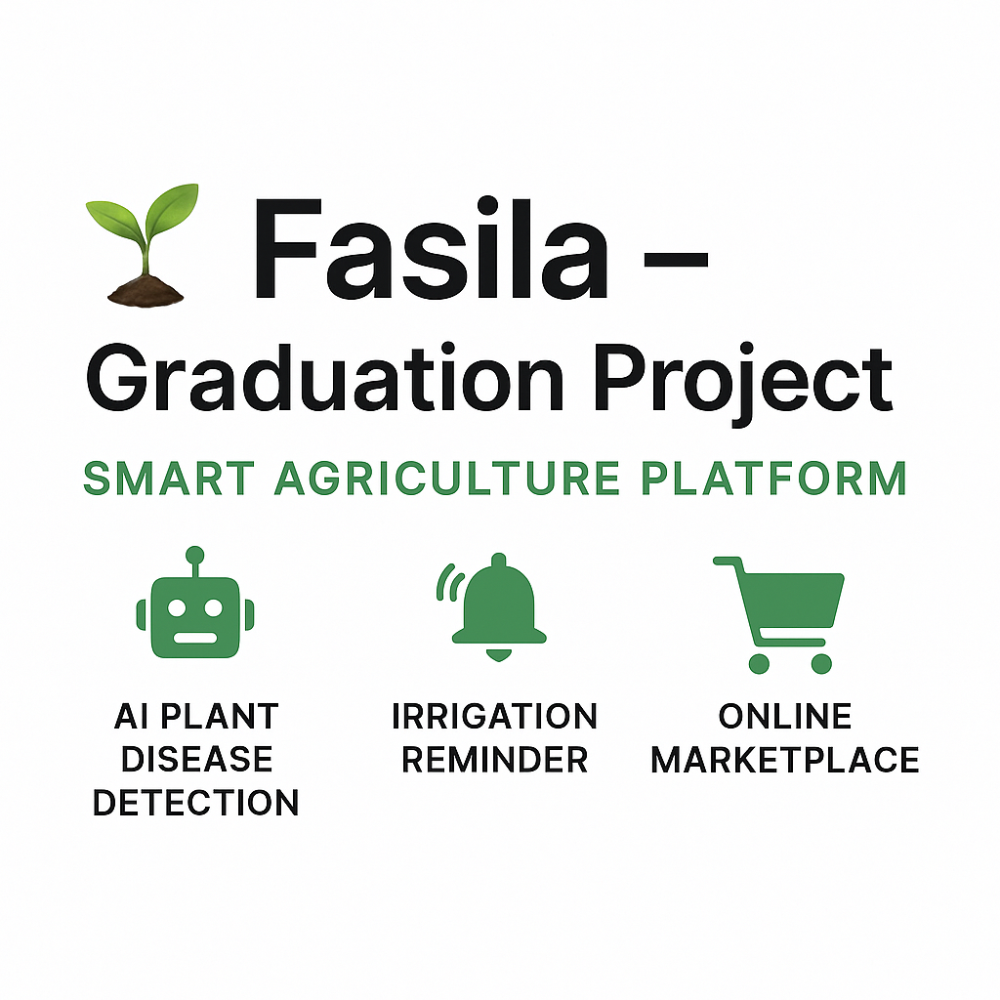

# 🌱 Fasila – Graduation Project

## 📌 Overview

Fasila is a smart agriculture platform designed to help farmers and plant enthusiasts manage their crops efficiently.  
The app uses **AI-powered plant disease detection**, a **smart irrigation reminder**, and an **online marketplace** for agricultural supplies.

Developed as a **Graduation Project – Faculty of Computers and Information, Mansoura University (2025)**.

---

## 🚀 Features

-   🤖 **AI Plant Disease Detection** – Upload a photo of a plant and get instant diagnosis.
-   ⏰ **Irrigation Reminder** – Notifications and scheduling for watering plants.
-   🛒 **Agriculture Marketplace** – Buy and sell farming tools and supplies.
-   🔍 **Plant Search** – Explore and learn about different plants.

---

## 🛠️ Tech Stack

-   **Backend**: PHP (Laravel Framework)
-   **Database**: MySQL
-   **Frontend**: HTML, CSS, JavaScript
-   **AI/ML**: Custom-trained model for plant disease detection

---

👨‍💻 Team

Mohamed Haitham Bahery – Backend Developer (Laravel)

Solo Project

---

## 📸 Screenshots

